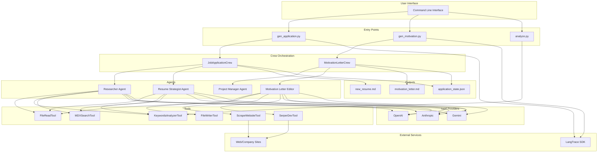
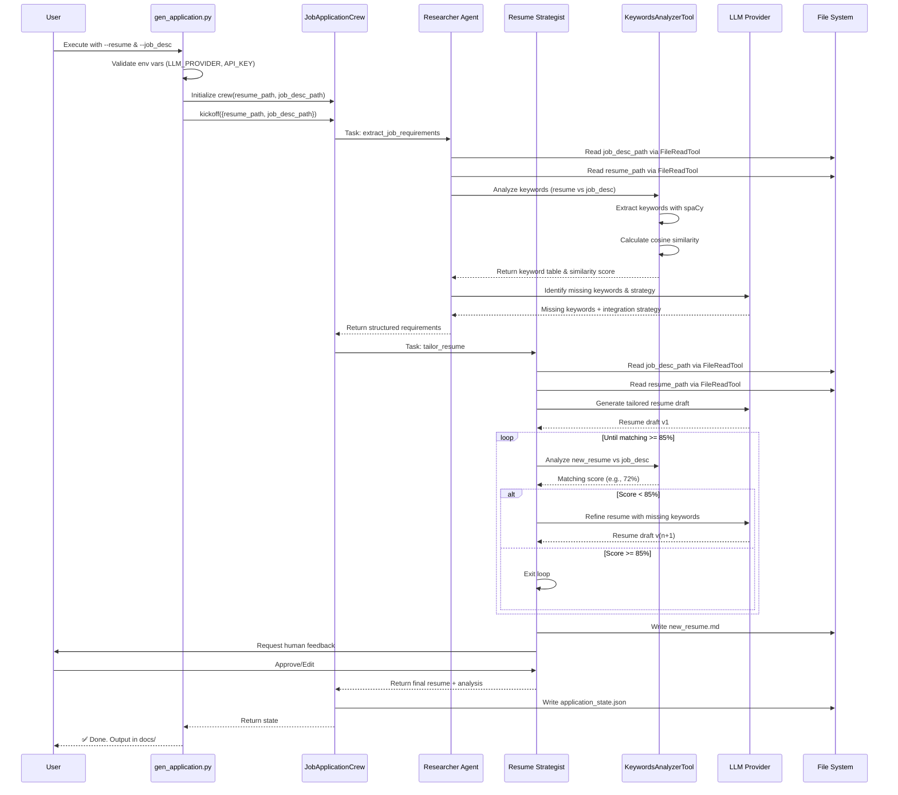
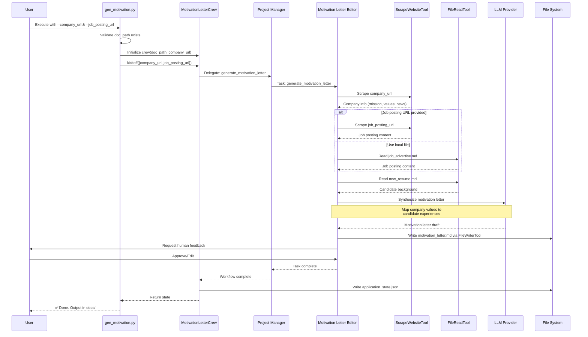
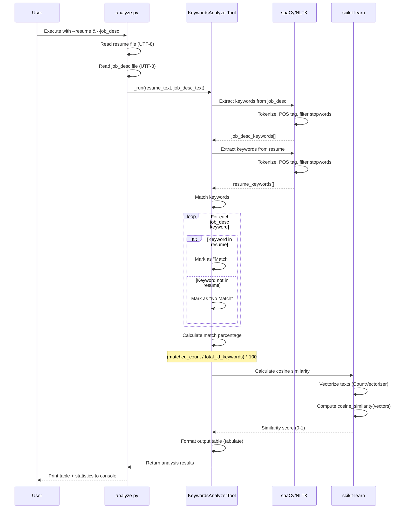

# CV-Pilot Architecture Documentation

## Overview

CV-Pilot is an AI-powered resume and motivation letter tailoring system that leverages multi-agent orchestration (CrewAI) to optimize job applications for Applicant Tracking Systems (ATS). The system achieves 85%+ keyword matching by iteratively refining documents using LLM-powered agents.

---

## System Architecture

### High-Level Components



---

## Component Details

### 1. Entry Points

| Component | Purpose | Inputs | Outputs |
|-----------|---------|--------|---------|
| `gen_application.py` | Resume tailoring orchestrator | Resume file, Job description | `new_resume.md`, `application_state.json` |
| `gen_motivation.py` | Motivation letter generator | Company URL, Job posting URL | `motivation_letter.md`, `application_state.json` |
| `analyze.py` | Keyword analyzer | Resume file, Job description | Console output (keyword stats, similarity) |

### 2. Crews (Multi-Agent Orchestration)

#### JobApplicationCrew
- **Process**: Sequential
- **Agents**: Researcher, Resume Strategist
- **Goal**: Generate ATS-optimized resume with 85%+ matching score
- **Iteration**: Continues until 85% threshold achieved

#### MotivationLetterCrew
- **Process**: Hierarchical (with Project Manager)
- **Agents**: Project Manager, Motivation Letter Editor
- **Goal**: Generate personalized motivation letter aligned with company values
- **Features**: Company research, value mapping, narrative crafting

### 3. AI Agents

| Agent | Role | Tools | Max Iterations |
|-------|------|-------|----------------|
| **Researcher** | Job market analyst, extracts requirements from job descriptions | FileReadTool, KeywordsAnalyzerTool, MDXSearchTool | 50 |
| **Resume Strategist** | Tailors resume content to job requirements | FileReadTool, KeywordsAnalyzerTool, MDXSearchTool | 60 |
| **Project Manager** | Coordinates motivation letter workflow | N/A (delegation only) | Default |
| **Motivation Letter Editor** | Drafts motivation letters with company research | FileReadTool, FileWriterTool, ScrapeWebsiteTool, DirectoryReadTool | 70 |

### 4. Tools

| Tool | Purpose | Technology |
|------|---------|------------|
| **KeywordsAnalyzerTool** | NLP keyword extraction, cosine similarity calculation | spaCy, NLTK, scikit-learn |
| **FileReadTool** | Read local files (MD, TXT, PDF) | CrewAI Tools |
| **ScrapeWebsiteTool** | Extract company information from websites | CrewAI Tools |
| **SerperDevTool** | Web search for additional context | CrewAI Tools |
| **FileWriterTool** | Write output files | CrewAI Tools |
| **MDXSearchTool** | Search MDX/Markdown documents | CrewAI Tools |

### 5. LLM Integration

- **Supported Providers**: OpenAI, Anthropic, Gemini
- **Configuration**: Environment variables (`LLM_PROVIDER`, `{PROVIDER}_API_KEY`)
- **Default Models**:
  - OpenAI: `gpt-4.1-2025-04-14`
  - Anthropic: `claude-3-7-sonnet-20250219`
  - Gemini: `gemini-2.5-pro-exp-03-25`
- **Tracing**: LangTrace SDK integration (optional)

---

## Sequence Diagrams

### Resume Generation Flow



---

### Motivation Letter Generation Flow



---

### Keyword Analysis Flow



---

## Data Flow

### Input Files
- **Resume**: Markdown, TXT, or PDF (candidate's original resume)
- **Job Description**: Markdown or plain text (target job posting)
- **Company URL**: Public website for motivation letter research

### Output Files
- **new_resume.md**: Tailored resume optimized for ATS (85%+ matching)
- **motivation_letter.md**: Personalized cover letter aligned with company values
- **application_state.json**: Complete audit trail of agent interactions and decisions

### State Management
```json
{
  "tasks_outputs": [
    {
      "task": "extract_job_requirements",
      "agent": "researcher",
      "output": "...",
      "raw": "..."
    },
    {
      "task": "tailor_resume",
      "agent": "resume_strategist",
      "output": "...",
      "raw": "..."
    }
  ],
  "metadata": {
    "timestamp": "...",
    "model_used": "..."
  }
}
```

---

## Key Design Patterns

### 1. Multi-Agent Orchestration
- **Pattern**: Agent-based workflow with specialized roles
- **Implementation**: CrewAI framework with YAML-driven configuration
- **Benefits**: Separation of concerns, parallel processing capabilities

### 2. Iterative Refinement
- **Pattern**: Feedback loop with quality gates
- **Threshold**: 85% ATS matching score
- **Mechanism**: KeywordsAnalyzerTool provides objective metrics for iteration decision

### 3. Human-in-the-Loop
- **Checkpoints**: After resume generation and motivation letter drafting
- **Purpose**: Quality assurance, tone adjustment, accuracy verification
- **Implementation**: `human_input: true` in task configuration

### 4. Tool-Based Architecture
- **Pattern**: Composable tools injected into agents
- **Caching**: Lambda-based caching for expensive operations (web scraping, searches)
- **Extensibility**: New tools can be added without modifying agent logic

---

## Configuration

### Environment Variables
```bash
# Required
LLM_PROVIDER=openai              # openai | anthropic | gemini
OPENAI_API_KEY=sk-...           # Provider-specific API key

# Optional
LANGTRACE_API_KEY=...           # For detailed tracing
MODEL_NAME=gpt-4.1-2025-04-14   # Override default model
```

### YAML Configuration
- **agents.yaml**: Defines agent roles, goals, backstories, max iterations
- **tasks.yaml**: Defines task descriptions, expected outputs, file paths, human input flags

---

## Performance Characteristics

### Iteration Limits
- Researcher: Max 50 iterations
- Resume Strategist: Max 60 iterations  
- Motivation Letter Editor: Max 70 iterations

### Caching Strategy
- Web scraping results cached via lambda function
- Search results cached to reduce API calls
- File reads not cached (to ensure fresh data)

### Quality Gates
- **ATS Score**: ≥ 85% keyword matching and cosine similarity
- **Verification**: KeywordsAnalyzerTool run after each resume draft
- **Audit**: Complete state logged to `application_state.json`

---

## Technology Stack

| Layer | Technologies |
|-------|-------------|
| **Orchestration** | CrewAI, Python 3.11+ |
| **LLM Integration** | OpenAI, Anthropic, Gemini APIs |
| **NLP/ML** | spaCy, NLTK, scikit-learn |
| **Tools** | crewai-tools (file I/O, web scraping, search) |
| **Observability** | LangTrace SDK |
| **Configuration** | YAML, environment variables |
| **Data Formats** | Markdown, JSON, TXT, PDF |

---

## Extension Points

### Adding New LLM Providers
1. Add model name to `_default_models` dict in crew files
2. Set `LLM_PROVIDER` and corresponding API key
3. No code changes required

### Adding New Tools
1. Create tool class extending `BaseTool` from CrewAI
2. Implement `_run()` method
3. Inject into agent via `tools=[...]` parameter

### Adding New Agents
1. Define agent in `agents.yaml` (role, goal, backstory)
2. Create `@agent` method in crew class
3. Reference in task assignments

### Adding New Tasks
1. Define task in `tasks.yaml` (description, expected_output, agent)
2. Create `@task` method in crew class
3. Add to crew task sequence

---

## Security Considerations

- **API Keys**: Stored in environment variables (never hardcoded)
- **File Access**: Limited to specified paths (no arbitrary file access)
- **Web Scraping**: Respects public data only (no authentication bypass)
- **Data Privacy**: Resume data processed locally, only LLM calls external
- **Output Sanitization**: Human review before submission

---

## Future Enhancements

1. **Native PDF/DOCX Parsing**: Direct support for binary resume formats
2. **Parallel Workflows**: Run keyword extraction and tailoring concurrently
3. **Dashboard**: Web UI for visualizing `application_state.json` over time
4. **Enhanced Analysis**: Word clouds, trend charts for keyword frequencies
5. **Sentiment Analysis**: Tone optimization for motivation letters
6. **A/B Testing**: Multiple resume variants with comparative ATS scoring
