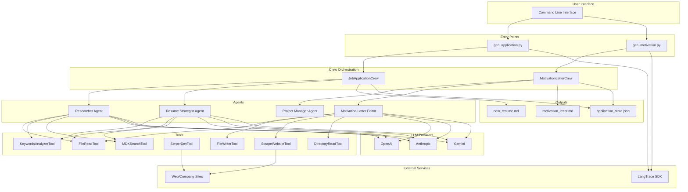
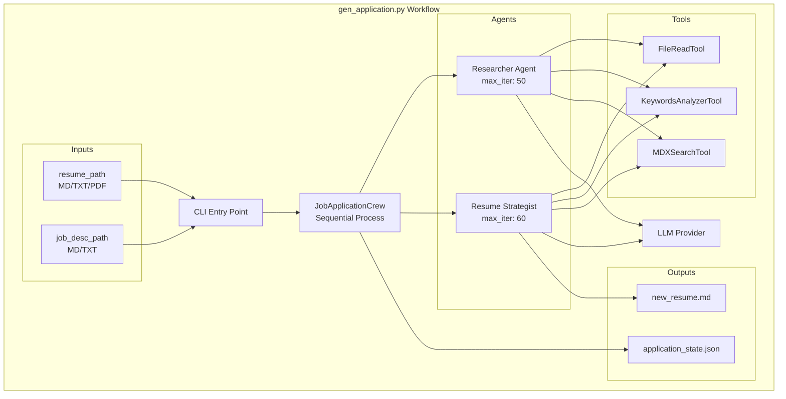
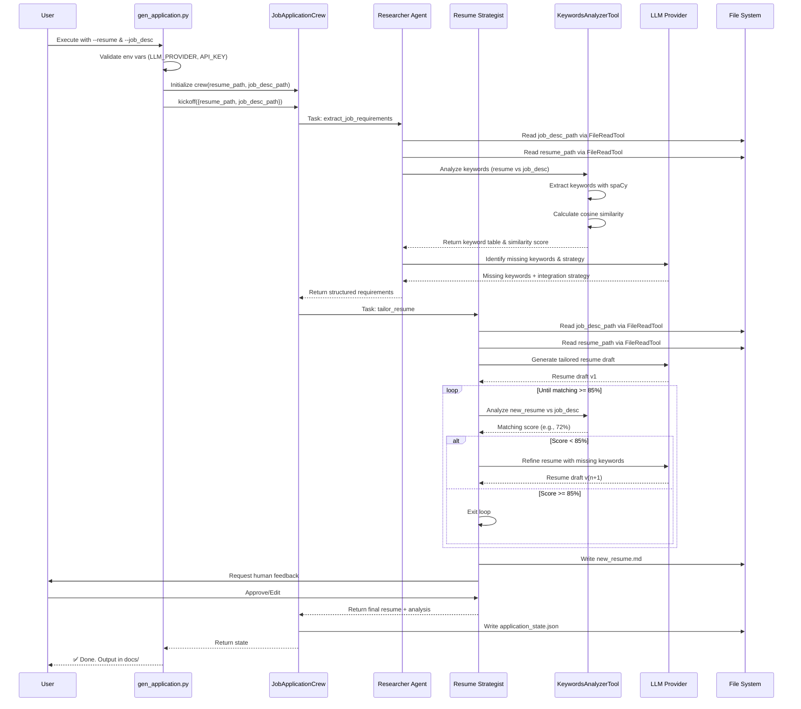
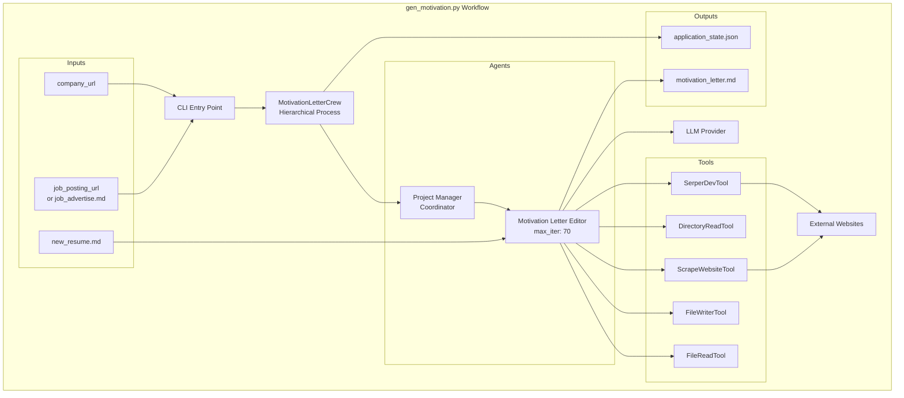
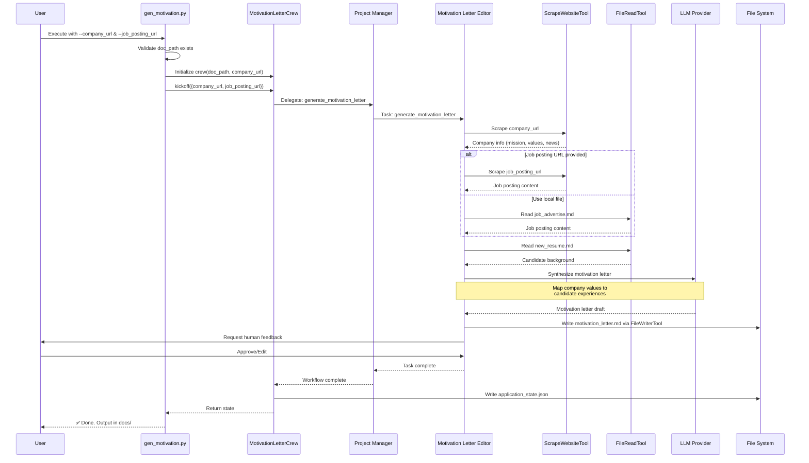

# CV-Pilot Architecture Documentation

## Overview

CV-Pilot is an AI-powered resume and motivation letter tailoring system that leverages multi-agent orchestration (CrewAI) to optimize job applications for Applicant Tracking Systems (ATS). The system achieves 85%+ keyword matching by iteratively refining documents using LLM-powered agents.

The system consists of two main workflows:
1. **Resume Generation** (`gen_application.py`) - Tailors resumes to job descriptions
2. **Motivation Letter Generation** (`gen_motivation.py`) - Creates personalized cover letters

---

## System Architecture

### High-Level Components



---

## Entry Points

| Component | Purpose | Inputs | Outputs |
|-----------|---------|--------|---------|
| `gen_application.py` | Resume tailoring orchestrator | Resume file, Job description | `new_resume.md`, `application_state.json` |
| `gen_motivation.py` | Motivation letter generator | Company URL, Job posting URL/file | `motivation_letter.md`, `application_state.json` |

---

## Shared Components

### Tools

| Tool | Purpose | Technology |
|------|---------|------------|
| **KeywordsAnalyzerTool** | NLP keyword extraction, cosine similarity calculation | spaCy, NLTK, scikit-learn |
| **FileReadTool** | Read local files (MD, TXT, PDF) | CrewAI Tools |
| **ScrapeWebsiteTool** | Extract company information from websites | CrewAI Tools |
| **SerperDevTool** | Web search for additional context | CrewAI Tools |
| **FileWriterTool** | Write output files | CrewAI Tools |
| **MDXSearchTool** | Search MDX/Markdown documents | CrewAI Tools |
| **DirectoryReadTool** | Read directory contents | CrewAI Tools |

### LLM Integration

- **Supported Providers**: OpenAI, Anthropic, Gemini
- **Configuration**: Environment variables (`LLM_PROVIDER`, `{PROVIDER}_API_KEY`)
- **Default Models**:
  - OpenAI: `gpt-4.1-2025-04-14`
  - Anthropic: `claude-3-7-sonnet-20250219`
  - Gemini: `gemini-2.5-pro-exp-03-25`
- **Tracing**: LangTrace SDK integration (optional)

---

# 1. Resume Generation Workflow (`gen_application.py`)

## Overview

The resume generation workflow uses a sequential multi-agent process to analyze job descriptions and tailor resumes to achieve 85%+ ATS matching scores through iterative refinement.

## Architecture

### Crew: JobApplicationCrew
- **Process**: Sequential
- **Agents**: Researcher, Resume Strategist
- **Goal**: Generate ATS-optimized resume with 85%+ matching score
- **Iteration**: Continues until 85% threshold achieved

### Agents

| Agent | Role | Tools | Max Iterations |
|-------|------|-------|----------------|
| **Researcher** | Job market analyst, extracts requirements from job descriptions | FileReadTool, KeywordsAnalyzerTool, MDXSearchTool | 50 |
| **Resume Strategist** | Tailors resume content to job requirements | FileReadTool, KeywordsAnalyzerTool, MDXSearchTool | 60 |

### Component Diagram



## Sequence Diagram



## Tasks

### Task 1: extract_job_requirements
- **Agent**: Researcher
- **Description**: Extract and categorize all key skills, experiences, and qualifications from the job advertisement
- **Process**:
  1. Read job description file via FileReadTool
  2. Read resume file via FileReadTool
  3. Extract key terms using KeywordsAnalyzerTool
  4. Identify keywords not present in the resume
  5. Search web for context on missing keywords
- **Output**: Structured list of technical skills, soft skills, education, experience requirements

### Task 2: tailor_resume
- **Agent**: Resume Strategist
- **Description**: Craft a new resume optimized for ATS with 85%+ matching score
- **Process**:
  1. Read job description and original resume
  2. Generate tailored resume draft using LLM
  3. Analyze draft with KeywordsAnalyzerTool
  4. If score < 85%, refine and repeat
  5. Write final resume to file
- **Human Input**: Yes (after completion)
- **Output**: `new_resume.md` with 85%+ ATS score

## Data Flow

### Inputs
- **resume_path**: Original resume (Markdown, TXT, or PDF)
- **job_desc_path**: Target job description (Markdown or TXT)

### Outputs
- **new_resume.md**: Tailored resume optimized for the job posting
- **application_state.json**: Complete audit trail of all agent interactions

### Environment Variables
```bash
LLM_PROVIDER=openai              # openai | anthropic | gemini
OPENAI_API_KEY=sk-...           # Provider-specific API key
LANGTRACE_API_KEY=...           # Optional tracing
```

## Usage Example

```bash
python3 src/gen_application.py \
  --resume dcos/fake_resume.md \
  --job_desc docs/job_advertise.md
```

---

# 2. Motivation Letter Generation Workflow (`gen_motivation.py`)

## Overview

The motivation letter workflow uses a hierarchical multi-agent process with a Project Manager coordinating research and writing to create personalized cover letters aligned with company values.

## Architecture

### Crew: MotivationLetterCrew
- **Process**: Hierarchical (with Project Manager)
- **Agents**: Project Manager, Motivation Letter Editor
- **Goal**: Generate personalized motivation letter aligned with company values
- **Features**: Company research, value mapping, narrative crafting

### Agents

| Agent | Role | Tools | Max Iterations |
|-------|------|-------|----------------|
| **Project Manager** | Coordinates motivation letter workflow | N/A (delegation only) | Default |
| **Motivation Letter Editor** | Drafts motivation letters with company research | FileReadTool, FileWriterTool, ScrapeWebsiteTool, DirectoryReadTool, SerperDevTool | 70 |

### Component Diagram



## Sequence Diagram



## Tasks

### Task 1: generate_motivation_letter
- **Agent**: Motivation Letter Editor (coordinated by Project Manager)
- **Description**: Research company and draft tailored motivation letter aligned with company values
- **Process**:
  1. Scrape company URL for mission, vision, values, culture, news
  2. Read job posting (URL or local file job_advertise.md)
  3. Read candidate's new_resume.md
  4. Synthesize insights using LLM
  5. Draft structured letter:
     - Introduction: Hook on shared value or company milestone
     - Body: Map company values to candidate experiences (2-3 paragraphs)
     - Conclusion: Enthusiasm and call to action
  6. Write to motivation_letter.md
- **Human Input**: Yes (after completion)
- **Output**: `motivation_letter.md`, sources/files list

## Data Flow

### Inputs
- **company_url**: Target company's public website URL
- **job_posting_url**: (Optional) Remote job posting URL
- **job_advertise.md**: (Fallback) Local job posting file in doc_path
- **new_resume.md**: Candidate's tailored resume from gen_application

### Outputs
- **motivation_letter.md**: Personalized cover letter
- **application_state.json**: Complete audit trail of agent interactions

### Environment Variables
```bash
LLM_PROVIDER=openai              # openai | anthropic | gemini
OPENAI_API_KEY=sk-...           # Provider-specific API key
LANGTRACE_API_KEY=...           # Optional tracing
```

## Usage Example

```bash
# Using local job posting file
python3 src/gen_motivation.py \
  --company_url "https://example-company.com" \
  --doc_path docs

# Using remote job posting URL
python3 src/gen_motivation.py \
  --company_url "https://example-company.com" \
  --job_posting_url "https://jobs.example.com/12345" \
  --doc_path docs
```

---

# System-Wide Considerations

## State Management

Both workflows generate an `application_state.json` file that captures the complete audit trail:

```json
{
  "tasks_outputs": [
    {
      "task": "extract_job_requirements",
      "agent": "researcher",
      "output": "...",
      "raw": "..."
    },
    {
      "task": "tailor_resume",
      "agent": "resume_strategist",
      "output": "...",
      "raw": "..."
    }
  ],
  "metadata": {
    "timestamp": "...",
    "model_used": "..."
  }
}
```

---

## Key Design Patterns

### 1. Multi-Agent Orchestration
- **Pattern**: Agent-based workflow with specialized roles
- **Implementation**: CrewAI framework with YAML-driven configuration
- **Benefits**: Separation of concerns, specialized expertise per agent

### 2. Iterative Refinement (Resume Workflow)
- **Pattern**: Feedback loop with quality gates
- **Threshold**: 85% ATS matching score
- **Mechanism**: KeywordsAnalyzerTool provides objective metrics for iteration decision

### 3. Human-in-the-Loop
- **Checkpoints**: After resume generation and motivation letter drafting
- **Purpose**: Quality assurance, tone adjustment, accuracy verification
- **Implementation**: `human_input: true` in task configuration

### 4. Tool-Based Architecture
- **Pattern**: Composable tools injected into agents
- **Caching**: Lambda-based caching for expensive operations (web scraping, searches)
- **Extensibility**: New tools can be added without modifying agent logic

### 5. Process Differentiation
- **Sequential** (Resume): Linear workflow with quality gate iteration
- **Hierarchical** (Motivation): Manager coordinates specialized tasks

---

## Configuration

### Environment Variables
```bash
# Required
LLM_PROVIDER=openai              # openai | anthropic | gemini
OPENAI_API_KEY=sk-...           # Provider-specific API key

# Optional
LANGTRACE_API_KEY=...           # For detailed tracing
MODEL_NAME=gpt-4.1-2025-04-14   # Override default model
```

### YAML Configuration Files

Each crew has two YAML configuration files:

**`config/agents.yaml`**
- Defines agent roles, goals, backstories
- Sets max iterations per agent
- Specifies delegation capabilities

**`config/tasks.yaml`**
- Defines task descriptions and expected outputs
- Maps tasks to agents
- Sets human input requirements
- Specifies output files

---

## Performance Characteristics

### Iteration Limits
| Workflow | Agent | Max Iterations |
|----------|-------|----------------|
| Resume Generation | Researcher | 50 |
| Resume Generation | Resume Strategist | 60 |
| Motivation Letter | Motivation Letter Editor | 70 |

### Caching Strategy
- Web scraping results cached via lambda function
- Search results cached to reduce API calls
- File reads not cached (to ensure fresh data)

### Quality Gates
- **Resume Workflow**: ≥ 85% keyword matching and cosine similarity
- **Verification**: KeywordsAnalyzerTool run after each resume draft
- **Audit**: Complete state logged to `application_state.json`

---

## Technology Stack

| Layer | Technologies |
|-------|-------------|
| **Orchestration** | CrewAI, Python 3.11+ |
| **LLM Integration** | OpenAI, Anthropic, Gemini APIs |
| **NLP/ML** | spaCy, NLTK, scikit-learn (KeywordsAnalyzerTool) |
| **Tools** | crewai-tools (file I/O, web scraping, search) |
| **Observability** | LangTrace SDK (optional) |
| **Configuration** | YAML, environment variables |
| **Data Formats** | Markdown, JSON, TXT, PDF |

---

## Extension Points

### Adding New LLM Providers
1. Add model name to `_default_models` dict in crew files
2. Set `LLM_PROVIDER` and corresponding API key
3. No code changes required

### Adding New Tools
1. Create tool class extending `BaseTool` from CrewAI
2. Implement `_run()` method
3. Inject into agent via `tools=[...]` parameter

### Adding New Agents
1. Define agent in `agents.yaml` (role, goal, backstory)
2. Create `@agent` method in crew class
3. Reference in task assignments

### Adding New Tasks
1. Define task in `tasks.yaml` (description, expected_output, agent)
2. Create `@task` method in crew class
3. Add to crew task sequence

---

## Security Considerations

- **API Keys**: Stored in environment variables (never hardcoded)
- **File Access**: Limited to specified paths (no arbitrary file access)
- **Web Scraping**: Respects public data only (no authentication bypass)
- **Data Privacy**: Resume data processed locally, only LLM calls external
- **Output Sanitization**: Human review before submission

---

## Future Enhancements

### Resume Generation
1. **Native PDF/DOCX Parsing**: Direct support for binary resume formats
2. **A/B Testing**: Multiple resume variants with comparative ATS scoring
3. **Enhanced Metrics**: Additional scoring beyond keyword matching

### Motivation Letter
4. **Sentiment Analysis**: Tone optimization for personalized authenticity
5. **Multi-Company Research**: Batch processing for multiple applications

### System-Wide
6. **Parallel Workflows**: Run both workflows simultaneously when job posting is common
7. **Dashboard**: Web UI for visualizing `application_state.json` over time
8. **Analytics**: Track success rates and ATS score correlation with interview callbacks
