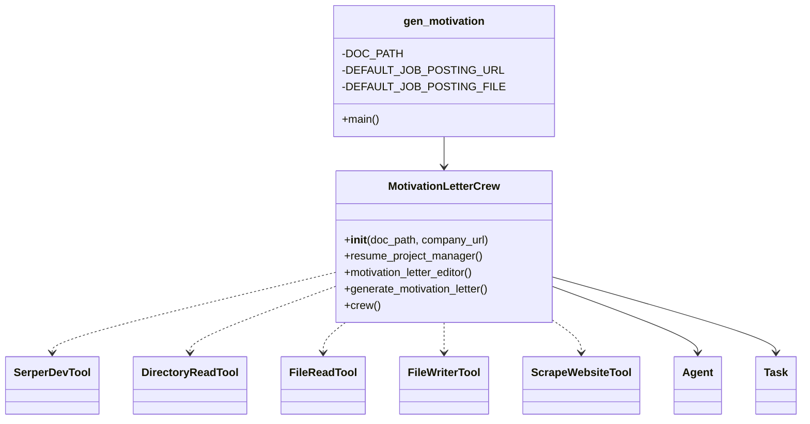
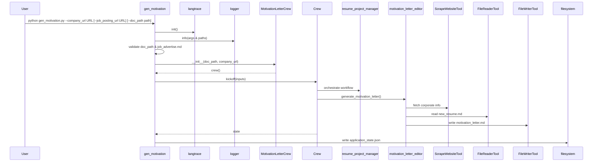

## 1. Overview

The `gen_motivation.py` script is the CLI entry point for generating a tailored motivation letter using Crew AI. It:

1. Initializes tracing (`langtrace`) and logging
2. Parses command-line arguments (`--company_url`, `--job_posting_url`, `--doc_path`)
3. Validates that the docs directory and job posting (URL or file) exist
4. Instantiates the `MotivationLetterCrew` (which wires together agents & tools)
5. Kicks off the hierarchical multi-agent process to run the `generate_motivation_letter` task
6. Dumps the resulting application state to `application_state.json` in the docs folder&#x20;

---

## 2. High-Level Flow

```mermaid
flowchart TD
  A[User runs gen_motivation.py] --> B[Init langtrace & logging]
  B --> C[Parse args (--company_url, --job_posting_url, --doc_path)]
  C --> D{Validate doc_path & job_posting}
  D -->|Fail| E[Error & exit]
  D -->|Pass| F[Instantiate MotivationLetterCrew]
  F --> G[Crew.kickoff(inputs)]
  G --> H[Run generate_motivation_letter task]
  H --> I[Write application_state.json]
  I --> J[Exit success]
```

---

## 3. Component Breakdown

### 3.1 Entry Point: `gen_motivation.py`&#x20;

```python
#!/usr/bin/env python3
import sys, os, json, logging, argparse
from langtrace_python_sdk import langtrace
from crews.motivation_letter.motivation_letter_crew import MotivationLetterCrew

langtrace.init(api_key=os.getenv("LANGTRACE_API_KEY"))

DOC_PATH = "docs"
DEFAULT_JOB_POSTING_URL = "N/A"
DEFAULT_JOB_POSTING_FILE = "job_advertise.md"

logging.basicConfig(level=logging.INFO, format="%(asctime)s %(levelname)s: %(message)s")
logger = logging.getLogger(__name__)

def main():
    parser = argparse.ArgumentParser(description="Generate a tailored motivation letter")
    parser.add_argument("--company_url", required=True, help="Public URL of the company")
    parser.add_argument("--job_posting_url", default=DEFAULT_JOB_POSTING_URL, help="URL of the job posting")
    parser.add_argument("--doc_path",       default=DOC_PATH,               help="Directory to write output files")
    args = parser.parse_args()

    doc_path = os.path.abspath(args.doc_path)
    if not os.path.exists(doc_path):
        logger.error(f"❌ Doc path {doc_path} does not exist.")
        raise FileNotFoundError(f"Doc path `{doc_path}` does not exist.")
    if not os.path.exists(os.path.join(doc_path, DEFAULT_JOB_POSTING_FILE)) \
       and args.job_posting_url == DEFAULT_JOB_POSTING_URL:
        logger.error("❌ Job posting URL not provided and job_advertise.md missing.")
        raise FileNotFoundError("Provide a job_posting_url or save job_advertise.md in docs.")

    logger.info("📄 Docs path: %s", doc_path)
    logger.info("📄 Job posting: %s", args.job_posting_url)
    logger.info("📄 Company URL: %s", args.company_url)
    logger.info("🧠 GenAI provider: %s", os.getenv("LLM_PROVIDER", "not set").upper())

    try:
        crew = MotivationLetterCrew(doc_path, args.company_url).crew()
        state = crew.kickoff({
            "company_url":     args.company_url,
            "job_posting_url": args.job_posting_url
        })
        with open(os.path.join(doc_path, "application_state.json"), "w") as f:
            json.dump(state.model_dump() if hasattr(state, "model_dump") else dict(state), f, indent=2)
        logger.info("✅ Done. Docs in `%s`.", doc_path)
    except Exception:
        logger.exception("💥 An unexpected error occurred:")
        sys.exit(1)

if __name__ == "__main__":
    main()
```

---

### 3.2 Crew Definition: `MotivationLetterCrew` &#x20;

```python
@CrewBase
class MotivationLetterCrew:
    agents_config = "config/agents.yaml"
    tasks_config  = "config/tasks.yaml"

    def __init__(self, doc_path: str, company_url: str):
        self.doc_path = doc_path
        always_cache = lambda args, result: True

        self._search_tool      = SerperDevTool();       self._search_tool.cache_function = always_cache
        self._doc_dir_tool     = DirectoryReadTool(directory=doc_path); self._doc_dir_tool.cache_function = always_cache
        self._file_read_tool   = FileReadTool()
        self._file_write_tool  = FileWriterTool()
        self._scrape_website_tool = ScrapeWebsiteTool(website_url=company_url)

    @agent
    def resume_project_manager(self) -> Agent:
        return Agent(
            config=self.agents_config["resume_project_manager"],
            llm=llm_client,
            verbose=True,
            allow_delegation=True
        )

    @agent
    def motivation_letter_editor(self) -> Agent:
        return Agent(
            config=self.agents_config["motivation_letter_editor"],
            tools=[self._doc_dir_tool, self._file_read_tool, self._file_write_tool, self._scrape_website_tool],
            llm=llm_client,
            verbose=True,
            allow_delegation=False
        )

    @task
    def generate_motivation_letter(self) -> Task:
        return Task(config=self.tasks_config["generate_motivation_letter"])

    @crew
    def crew(self) -> Crew:
        manager = self.resume_project_manager()
        operational_agents = [a for a in self.agents if a is not manager]
        return Crew(
            agents=operational_agents,
            tasks=self.tasks,
            process=Process.hierarchical,
            manager_agent=manager,
            manager_llm=llm_client,
            planning=True,
            verbose=True
        )
```

#### Tools Wired into the Crew

* **SerperDevTool** for web search (company & posting)
* **DirectoryReadTool** for local docs listing
* **FileReadTool** to ingest existing files
* **FileWriterTool** to output `motivation_letter.md`
* **ScrapeWebsiteTool** to gather corporate info&#x20;

---

## 4. Configuration Files

### 4.1 Agents (`config/agents.yaml`)

Defines the `resume_project_manager` and `motivation_letter_editor` roles, goals, backstories, verbosity, and iteration limits .

### 4.2 Tasks (`config/tasks.yaml`)

```yaml
generate_motivation_letter:
  description: >
    Research the company at {company_url}; analyze the job posting ({job_posting_url} or job_advertise.md);
    read new_resume.md; draft a structured motivation letter (intro → body → conclusion);
    list all sources for traceability.
  expected_output: >
    A motivation_letter.md containing the letter (intro, body, conclusion) plus a sources_and_files section.
  agent: motivation_letter_editor
  output_file: "motivation_letter.md"
  human_input: true
```


---

## 5. Class Diagram



---

## 6. Sequence Diagram



---

## 7. Runtime & Environment

* **Python** ≥3.9
* **Dependencies**:

  * `crewai` & `crewai-tools`
  * `langtrace_python_sdk`
  * Standard library: `argparse`, `os`, `sys`, `json`, `logging`
* **Environment Variables**:

  * `LANGTRACE_API_KEY` (required)
  * `LLM_PROVIDER` (e.g., `openai`)
  * `<PROVIDER>_API_KEY` (e.g., `OPENAI_API_KEY`)
  * `MODEL_NAME` (optional override)

---

## 8. Error Handling & Logging

* **Missing docs path** → logs ERROR + raises `FileNotFoundError`&#x20;
* **Missing job posting** → logs ERROR + raises `FileNotFoundError`
* **Runtime exceptions** → caught, logged via `logger.exception()`, then `sys.exit(1)`
* **Logging** at INFO level for key milestones (paths, URLs, provider)

---

## 9. Extensibility & Customization

* **Adding Agents/Tasks**: extend `config/agents.yaml` or `config/tasks.yaml` and decorate new methods on `MotivationLetterCrew`.
* **Tooling Swap**: swap out any of the wired tools in the constructor.
* **Alternate Processes**: switch `Process.hierarchical` to other Crew AI patterns (e.g., `sequential`, `parallel`).
* **Tracing**: adjust `langtrace` spans around heavy tasks for deeper observability.

---

This should serve as a comprehensive technical reference for the **gen\_motivation** component of your Crew AI solution. Let me know if you’d like further detail or additional diagrams!
